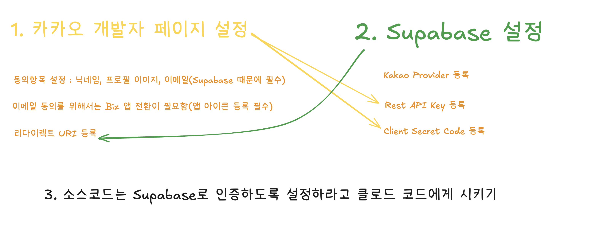

# 쇼핑몰 바이브 코딩

## 개요

exaclidraw.com에 붙여넣기 하기

```
{"type":"excalidraw/clipboard","elements":[{"id":"zskJIy0w_T2P59_JPgcrM","type":"rectangle","x":56851.59816963723,"y":7021.568432986413,"width":1174.126406491865,"height":185.0540645533465,"angle":0,"strokeColor":"#1e1e1e","backgroundColor":"#ffec99","fillStyle":"hachure","strokeWidth":2,"strokeStyle":"solid","roughness":1,"opacity":100,"groupIds":[],"frameId":null,"index":"b09","roundness":null,"seed":1496794975,"version":143,"versionNonce":1652059889,"isDeleted":false,"boundElements":[],"updated":1757778862817,"link":null,"locked":false},{"id":"VaD43rBuSuiCyPvyYdnFo","type":"rectangle","x":56851.64629079602,"y":6807.444210465042,"width":1174.126406491865,"height":185.0540645533465,"angle":0,"strokeColor":"#1e1e1e","backgroundColor":"#ffec99","fillStyle":"hachure","strokeWidth":2,"strokeStyle":"solid","roughness":1,"opacity":100,"groupIds":[],"frameId":null,"index":"b0A","roundness":null,"seed":1634020831,"version":70,"versionNonce":1628704529,"isDeleted":false,"boundElements":null,"updated":1757778843346,"link":null,"locked":false},{"id":"Nr8VsFM7N9Opfm35wIPpQ","type":"line","x":56924.64553503316,"y":6778.462765633107,"width":0,"height":510.3482686628522,"angle":0,"strokeColor":"#c2255c","backgroundColor":"transparent","fillStyle":"hachure","strokeWidth":2,"strokeStyle":"solid","roughness":1,"opacity":100,"groupIds":[],"frameId":null,"index":"bGT","roundness":null,"seed":1989501695,"version":47,"versionNonce":862218737,"isDeleted":false,"boundElements":null,"updated":1757778897071,"link":null,"locked":false,"points":[[0,0],[0,510.3482686628522]],"lastCommittedPoint":null,"startBinding":null,"endBinding":null,"startArrowhead":null,"endArrowhead":null,"polygon":false},{"id":"McXbScUXgSSfB5Pm3fU-M","type":"line","x":57243.18376947178,"y":6776.312586714881,"width":0,"height":232.61657500933416,"angle":0,"strokeColor":"#1971c2","backgroundColor":"transparent","fillStyle":"hachure","strokeWidth":2,"strokeStyle":"solid","roughness":1,"opacity":100,"groupIds":[],"frameId":null,"index":"bGU","roundness":null,"seed":1369357855,"version":197,"versionNonce":242191839,"isDeleted":false,"boundElements":[],"updated":1757778900536,"link":null,"locked":false,"points":[[0,0],[0,232.61657500933416]],"lastCommittedPoint":null,"startBinding":null,"endBinding":null,"startArrowhead":null,"endArrowhead":null,"polygon":false},{"id":"NzGG1PFxhWhOkFQixUWnw","type":"line","x":57571.61625104384,"y":6773.148398544206,"width":0.3252326594956685,"height":524.8675838189811,"angle":0,"strokeColor":"#2f9e44","backgroundColor":"transparent","fillStyle":"hachure","strokeWidth":2,"strokeStyle":"solid","roughness":1,"opacity":100,"groupIds":[],"frameId":null,"index":"bGV","roundness":null,"seed":1291175281,"version":225,"versionNonce":985015903,"isDeleted":false,"boundElements":[],"updated":1757778903897,"link":null,"locked":false,"points":[[0,0],[-0.3252326594956685,524.8675838189811]],"lastCommittedPoint":null,"startBinding":null,"endBinding":null,"startArrowhead":null,"endArrowhead":null,"polygon":false},{"id":"Rh_0ZA7wT6MTf7e5nvg_Z","type":"text","x":56899.59560121104,"y":6736.396177705334,"width":64.09702270888737,"height":30.875273572417576,"angle":0,"strokeColor":"#c2255c","backgroundColor":"transparent","fillStyle":"hachure","strokeWidth":2,"strokeStyle":"solid","roughness":1,"opacity":100,"groupIds":[],"frameId":null,"index":"bGW","roundness":null,"seed":2052131487,"version":100,"versionNonce":1927555487,"isDeleted":false,"boundElements":null,"updated":1757778897071,"link":null,"locked":false,"text":"쇼핑몰","fontSize":24.70021885793406,"fontFamily":6,"textAlign":"center","verticalAlign":"top","containerId":null,"originalText":"쇼핑몰","autoResize":true,"lineHeight":1.25},{"id":"dyerzVEmcq1IE43_VijxL","type":"text","x":57169.80097989819,"y":6736.53896681997,"width":205.18454769612418,"height":30.875273572417576,"angle":0,"strokeColor":"#1971c2","backgroundColor":"transparent","fillStyle":"hachure","strokeWidth":2,"strokeStyle":"solid","roughness":1,"opacity":100,"groupIds":[],"frameId":null,"index":"bGX","roundness":null,"seed":1778889201,"version":268,"versionNonce":2088764305,"isDeleted":false,"boundElements":[],"updated":1757778900536,"link":null,"locked":false,"text":"카카오 개발자 페이지","fontSize":24.70021885793406,"fontFamily":6,"textAlign":"center","verticalAlign":"top","containerId":null,"originalText":"카카오 개발자 페이지","autoResize":true,"lineHeight":1.25},{"id":"ErKeOfvc7RlFVuoLREMQL","type":"text","x":57526.57140645975,"y":6731.850763381619,"width":109.66886242955272,"height":30.875273572417576,"angle":0,"strokeColor":"#2f9e44","backgroundColor":"transparent","fillStyle":"hachure","strokeWidth":2,"strokeStyle":"solid","roughness":1,"opacity":100,"groupIds":[],"frameId":null,"index":"bGY","roundness":null,"seed":1870044593,"version":344,"versionNonce":267203345,"isDeleted":false,"boundElements":[],"updated":1757778903897,"link":null,"locked":false,"text":"Supabase","fontSize":24.70021885793406,"fontFamily":6,"textAlign":"center","verticalAlign":"top","containerId":null,"originalText":"Supabase","autoResize":true,"lineHeight":1.25},{"id":"Awx3WLSGThQDwoH3ds3z9","type":"arrow","x":56934.36158472776,"y":6865.617713407163,"width":294.3488316474686,"height":0.9889727809195392,"angle":0,"strokeColor":"#1e1e1e","backgroundColor":"transparent","fillStyle":"hachure","strokeWidth":2,"strokeStyle":"solid","roughness":1,"opacity":100,"groupIds":[],"frameId":null,"index":"bGZ","roundness":{"type":2},"seed":1098166815,"version":59,"versionNonce":333640977,"isDeleted":false,"boundElements":null,"updated":1757778707523,"link":null,"locked":false,"points":[[0,0],[294.3488316474686,0.9889727809195392]],"lastCommittedPoint":null,"startBinding":null,"endBinding":null,"startArrowhead":null,"endArrowhead":"arrow","elbowed":false},{"id":"iPaWyF-a84kwSpocTazm6","type":"text","x":57247.70964427354,"y":6865.946264767267,"width":96.93991088867188,"height":25,"angle":0,"strokeColor":"#1e1e1e","backgroundColor":"transparent","fillStyle":"hachure","strokeWidth":2,"strokeStyle":"solid","roughness":1,"opacity":100,"groupIds":[],"frameId":null,"index":"bGa","roundness":null,"seed":2095265855,"version":333,"versionNonce":1174522737,"isDeleted":false,"boundElements":null,"updated":1757778725440,"link":null,"locked":false,"text":"신규 앱 생성","fontSize":20,"fontFamily":6,"textAlign":"center","verticalAlign":"top","containerId":null,"originalText":"신규 앱 생성","autoResize":true,"lineHeight":1.25},{"id":"_wq-vqe4aumxxSE8UZmrO","type":"arrow","x":57252.117389482766,"y":6936.660434132641,"width":313.1059497533279,"height":0.3285513601040293,"angle":0,"strokeColor":"#1e1e1e","backgroundColor":"transparent","fillStyle":"hachure","strokeWidth":2,"strokeStyle":"solid","roughness":1,"opacity":100,"groupIds":[],"frameId":null,"index":"bGb","roundness":{"type":2},"seed":977123345,"version":189,"versionNonce":1835307121,"isDeleted":false,"boundElements":[],"updated":1757778814579,"link":null,"locked":false,"points":[[0,0],[313.1059497533279,-0.3285513601040293]],"lastCommittedPoint":null,"startBinding":null,"endBinding":null,"startArrowhead":null,"endArrowhead":"arrow","elbowed":false},{"id":"HVuEm4Rf1sXlh0OnNII-m","type":"text","x":56867.49832887637,"y":6827.0909180591625,"width":148.83987426757812,"height":25,"angle":0,"strokeColor":"#1e1e1e","backgroundColor":"transparent","fillStyle":"hachure","strokeWidth":2,"strokeStyle":"solid","roughness":1,"opacity":100,"groupIds":[],"frameId":null,"index":"bGc","roundness":null,"seed":1933986559,"version":123,"versionNonce":1319812799,"isDeleted":false,"boundElements":null,"updated":1757778718566,"link":null,"locked":false,"text":"쇼핑몰 페이지 생성","fontSize":20,"fontFamily":6,"textAlign":"center","verticalAlign":"top","containerId":null,"originalText":"쇼핑몰 페이지 생성","autoResize":true,"lineHeight":1.25},{"id":"Q35hHspeF2XJS5vm48iZ6","type":"text","x":57583.81781273942,"y":6948.371058232582,"width":172.4998321533203,"height":25,"angle":0,"strokeColor":"#1e1e1e","backgroundColor":"transparent","fillStyle":"hachure","strokeWidth":2,"strokeStyle":"solid","roughness":1,"opacity":100,"groupIds":[],"frameId":null,"index":"bGd","roundness":null,"seed":23553119,"version":453,"versionNonce":497474527,"isDeleted":false,"boundElements":[],"updated":1757778735863,"link":null,"locked":false,"text":"카카오 Provider 등록","fontSize":20,"fontFamily":6,"textAlign":"center","verticalAlign":"top","containerId":null,"originalText":"카카오 Provider 등록","autoResize":true,"lineHeight":1.25},{"id":"v1NN1qqQFfnngystWQJYC","type":"arrow","x":56932.300671650744,"y":7059.565895587578,"width":630.377224219701,"height":1.297611937381589,"angle":0,"strokeColor":"#1e1e1e","backgroundColor":"transparent","fillStyle":"hachure","strokeWidth":2,"strokeStyle":"solid","roughness":1,"opacity":100,"groupIds":[],"frameId":null,"index":"bGe","roundness":{"type":2},"seed":1163571231,"version":108,"versionNonce":1635006495,"isDeleted":false,"boundElements":null,"updated":1757778742535,"link":null,"locked":false,"points":[[0,0],[630.377224219701,1.297611937381589]],"lastCommittedPoint":null,"startBinding":null,"endBinding":null,"startArrowhead":null,"endArrowhead":"arrow","elbowed":false},{"id":"AmPq0q1fYBjFJ9EXpSa2k","type":"text","x":57018.38746651131,"y":7031.141224887636,"width":109.01991271972656,"height":25,"angle":0,"strokeColor":"#1e1e1e","backgroundColor":"transparent","fillStyle":"hachure","strokeWidth":2,"strokeStyle":"solid","roughness":1,"opacity":100,"groupIds":[],"frameId":null,"index":"bGf","roundness":null,"seed":1762465919,"version":64,"versionNonce":1191340657,"isDeleted":false,"boundElements":null,"updated":1757778749030,"link":null,"locked":false,"text":"사용자 로그인","fontSize":20,"fontFamily":6,"textAlign":"center","verticalAlign":"top","containerId":null,"originalText":"사용자 로그인","autoResize":true,"lineHeight":1.25},{"id":"p49kRCyuB8np91aQgTQxm","type":"line","x":57912.44021082699,"y":6774.004079147103,"width":0.3252326594956685,"height":524.8675838189811,"angle":0,"strokeColor":"#846358","backgroundColor":"transparent","fillStyle":"hachure","strokeWidth":2,"strokeStyle":"solid","roughness":1,"opacity":100,"groupIds":[],"frameId":null,"index":"bGg","roundness":null,"seed":1958568177,"version":319,"versionNonce":1490445009,"isDeleted":false,"boundElements":[],"updated":1757778908681,"link":null,"locked":false,"points":[[0,0],[-0.3252326594956685,524.8675838189811]],"lastCommittedPoint":null,"startBinding":null,"endBinding":null,"startArrowhead":null,"endArrowhead":null,"polygon":false},{"id":"PUxEMysnN8F4YdoYK2j0D","type":"text","x":57850.58160818507,"y":6727.824090701919,"width":156.00645943880156,"height":30.875273572417576,"angle":0,"strokeColor":"#846358","backgroundColor":"transparent","fillStyle":"hachure","strokeWidth":2,"strokeStyle":"solid","roughness":1,"opacity":100,"groupIds":[],"frameId":null,"index":"bGh","roundness":null,"seed":484677247,"version":170,"versionNonce":273854143,"isDeleted":false,"boundElements":null,"updated":1757778908681,"link":null,"locked":false,"text":"카카오 인증서버","fontSize":24.70021885793406,"fontFamily":6,"textAlign":"center","verticalAlign":"top","containerId":null,"originalText":"카카오 인증서버","autoResize":true,"lineHeight":1.25},{"id":"g_6r7Z2CLJMvv16zMo7Yx","type":"arrow","x":57580.432944118504,"y":7086.639855140423,"width":323.1120098093379,"height":0,"angle":0,"strokeColor":"#1e1e1e","backgroundColor":"transparent","fillStyle":"hachure","strokeWidth":2,"strokeStyle":"solid","roughness":1,"opacity":100,"groupIds":[],"frameId":null,"index":"bGi","roundness":{"type":2},"seed":1902836959,"version":40,"versionNonce":721155935,"isDeleted":false,"boundElements":null,"updated":1757778776008,"link":null,"locked":false,"points":[[0,0],[323.1120098093379,0]],"lastCommittedPoint":null,"startBinding":null,"endBinding":null,"startArrowhead":null,"endArrowhead":"arrow","elbowed":false},{"id":"W29HKO1W_zD75kVX050Fy","type":"text","x":57695.07198041643,"y":7061.663314371275,"width":91.71992492675781,"height":25,"angle":0,"strokeColor":"#1e1e1e","backgroundColor":"transparent","fillStyle":"hachure","strokeWidth":2,"strokeStyle":"solid","roughness":1,"opacity":100,"groupIds":[],"frameId":null,"index":"bGj","roundness":null,"seed":1195253695,"version":26,"versionNonce":2027387711,"isDeleted":false,"boundElements":null,"updated":1757778780968,"link":null,"locked":false,"text":"사용자 인증","fontSize":20,"fontFamily":6,"textAlign":"center","verticalAlign":"top","containerId":null,"originalText":"사용자 인증","autoResize":true,"lineHeight":1.25},{"id":"NAYZVBr80zxjiMZvwzsQl","type":"arrow","x":57903.07701714224,"y":7110.5444556134735,"width":317.3142398487107,"height":0,"angle":0,"strokeColor":"#1e1e1e","backgroundColor":"transparent","fillStyle":"hachure","strokeWidth":2,"strokeStyle":"solid","roughness":1,"opacity":100,"groupIds":[],"frameId":null,"index":"bGk","roundness":{"type":2},"seed":969895441,"version":62,"versionNonce":863377457,"isDeleted":false,"boundElements":null,"updated":1757778784370,"link":null,"locked":false,"points":[[0,0],[-317.3142398487107,0]],"lastCommittedPoint":null,"startBinding":null,"endBinding":null,"startArrowhead":null,"endArrowhead":"arrow","elbowed":false},{"id":"ppx411O6Pf0Jt96IkVzox","type":"text","x":57664.44385436083,"y":7116.302401166818,"width":144.57986450195312,"height":50,"angle":0,"strokeColor":"#1e1e1e","backgroundColor":"transparent","fillStyle":"hachure","strokeWidth":2,"strokeStyle":"solid","roughness":1,"opacity":100,"groupIds":[],"frameId":null,"index":"bGl","roundness":null,"seed":1470978513,"version":157,"versionNonce":1632363793,"isDeleted":false,"boundElements":null,"updated":1757779215950,"link":null,"locked":false,"text":"인증완료\n(사용자 정보 제공)","fontSize":20,"fontFamily":6,"textAlign":"center","verticalAlign":"top","containerId":null,"originalText":"인증완료\n(사용자 정보 제공)","autoResize":true,"lineHeight":1.25},{"id":"SlfRDp88CZMYWkibRqusJ","type":"arrow","x":57566.56309811402,"y":7155.730039842138,"width":630.8972640476568,"height":0,"angle":0,"strokeColor":"#1e1e1e","backgroundColor":"transparent","fillStyle":"hachure","strokeWidth":2,"strokeStyle":"solid","roughness":1,"opacity":100,"groupIds":[],"frameId":null,"index":"bGm","roundness":{"type":2},"seed":1938406143,"version":233,"versionNonce":1690327729,"isDeleted":false,"boundElements":[],"updated":1757778805454,"link":null,"locked":false,"points":[[0,0],[-630.8972640476568,0]],"lastCommittedPoint":null,"startBinding":null,"endBinding":null,"startArrowhead":null,"endArrowhead":"arrow","elbowed":false},{"id":"U5vZY9HXYHqiVrkg09bLm","type":"text","x":57019.09657260939,"y":7128.505263299181,"width":148.83987426757812,"height":25,"angle":0,"strokeColor":"#1e1e1e","backgroundColor":"transparent","fillStyle":"hachure","strokeWidth":2,"strokeStyle":"solid","roughness":1,"opacity":100,"groupIds":[],"frameId":null,"index":"bGn","roundness":null,"seed":112441873,"version":47,"versionNonce":683788703,"isDeleted":false,"boundElements":null,"updated":1757778823820,"link":null,"locked":false,"text":"사용자 로그인 완료","fontSize":20,"fontFamily":6,"textAlign":"center","verticalAlign":"top","containerId":null,"originalText":"사용자 로그인 완료","autoResize":true,"lineHeight":1.25},{"id":"HrSvUoNT3X05PJH2KNHWY","type":"text","x":56742.61004927184,"y":6893.932866987069,"width":96.93991088867188,"height":25,"angle":0,"strokeColor":"#f08c00","backgroundColor":"#ffec99","fillStyle":"hachure","strokeWidth":2,"strokeStyle":"solid","roughness":1,"opacity":100,"groupIds":[],"frameId":null,"index":"bGo","roundness":null,"seed":1169068735,"version":133,"versionNonce":1076941457,"isDeleted":false,"boundElements":null,"updated":1757778875445,"link":null,"locked":false,"text":"신규 앱 생성","fontSize":20,"fontFamily":6,"textAlign":"center","verticalAlign":"top","containerId":null,"originalText":"신규 앱 생성","autoResize":true,"lineHeight":1.25},{"id":"dlRx0tisoPxu6BLO9dAUh","type":"text","x":56735.956088743995,"y":7091.914815592132,"width":109.01991271972656,"height":25,"angle":0,"strokeColor":"#f08c00","backgroundColor":"#ffec99","fillStyle":"hachure","strokeWidth":2,"strokeStyle":"solid","roughness":1,"opacity":100,"groupIds":[],"frameId":null,"index":"bGp","roundness":null,"seed":676567263,"version":227,"versionNonce":854177681,"isDeleted":false,"boundElements":[],"updated":1757778873795,"link":null,"locked":false,"text":"카카오 로그인","fontSize":20,"fontFamily":6,"textAlign":"center","verticalAlign":"top","containerId":null,"originalText":"카카오 로그인","autoResize":true,"lineHeight":1.25}],"files":{}}
```

## 준비물

- Kakao Developers 회원가입하기
  - https://developers.kakao.com/
- Supabase 회원가입하기
  - https://supabase.com/
- 샘플 이미지 저장하기
  - Nano Banana 또는 ChatGPT 에 접속해서 `쇼핑몰에서 사용할 나이키 신발 하나 만들어줘`라고 해서 샘플 이미지 하나 만들어서 저장해두기

## 프로젝트 셋업 및 유저 프로필 생성하기

1. 쇼핑몰 프로젝트 생성하기

```
> project 디렉토리에 frontend 디렉토리 생성하고 여기에 간단한 신발 온라인 쇼핑몰 웹 만들어줘 Nextjs15, Typescript, tailwindcss를 사용해서 작업해줘, (다크모드는 하지 않음)
```

2. 카카오 로그인 및 Supabase 인증 설정하기



2-1) Playwright 전용 [Output Style](https://docs.anthropic.com/ko/docs/claude-code/output-styles) 을 설정한다.
```
> /output-style minimal-playwright
```

2-2) [Custom Command](https://docs.anthropic.com/ko/docs/claude-code/slash-commands) 내용에 따라 설정을 진행시키도록 한다. 
```
> /kakao-supabase-oauth <YourAppName>
```

2-3) 설정이 다 끝났다면 [SubAgent](https://docs.anthropic.com/ko/docs/claude-code/sub-agents)를 활용하여 대화 내용을 기록해보자

```
> @agent-conversation-summarizer
```


3. 유저 프로필 추가 정보 저장하기

```
> 유저 프로필 수정페이지를 만들어줘, 로그인한 유저의 프로필을 수정할 수 있어야함 그리고 supabase에도 저장하고 다시 불러올 수 있어야한다
```

## 기능 추가하기

1. 유저 프로필 유효성 검사로직 적용하기

```
> 프로필페이지에서 이름하고 전화번호 유효성 검증을 하면 좋겠다
```

2. 장바구니 담기 기능 분석 및 개선

```
> 장바구니 기능을 분석하고 개선할 부분이 있는지 체크해줘
```

3. 상품 이미지 돋보기 기능 추가하기

```
쿠팡처럼 이미지에 마우스 올렸을때 마우스 있는 부분의 이미지가 확대되어 보이는 기능을 만들어보자, 일단 테스트페이지에 만들어보자
참고 이미지: @sample-magnifier.png
```

