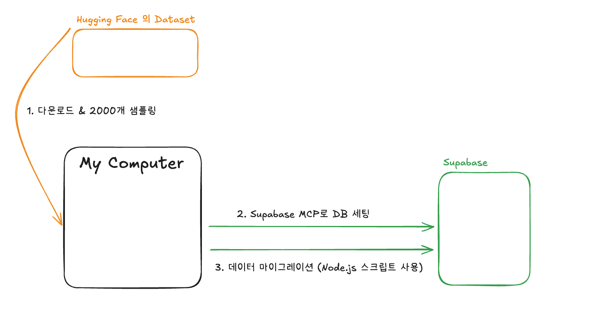

## 오늘의 명언

## 목적

명언을 추천하고 보여주는 웹서비스를 만들려고 한다.
AI를 활용해 대량의 명언 데이터를 생성하고, Supabase를 사용해 데이터베이스를 구축할 것이다.
랜덤 추천 기능과 검색 기능을 제공하며, 사용자 친화적인 UI를 구성한다.


## 기술 스택

- Frontend: HTML, CSS, JavaScript
- Database: Supabase PostgreSQL
- Tools: Supabase MCP, Node.js (데이터 업로드)



## 사전 준비: Supabase MCP 설정

**Supabase MCP란?**
Claude Code에서 Supabase를 직접 제어할 수 있게 해주는 연결 도구입니다.

**설정 방법:**

1. Supabase 대시보드 접속 (https://supabase.com)
2. 새 프로젝트 생성 또는 기존 프로젝트 선택
3. 왼쪽 메뉴에서 **"Connect"** 클릭
4. **"MCP"** 탭 클릭
5. 표시된 JSON 설정을 복사
6. 로컬의 `.mcp.json` 파일을 열고 복사한 내용을 추가
7. Claude Code 재시작

**설정 완료 확인:**
```
> /mcp
```
명령어 실행 시 "Connected to supabase" 메시지가 보이면 성공!

**연결 후 데이터베이스 확인:**
```
> supabase에 연결된 database 확인해줘
```

Supabase MCP가 정상적으로 연결되면:
- 데이터베이스 스키마 목록 확인 가능 (auth, storage, public)
- 테이블 목록 및 구조 확인 가능
- 설치된 확장 기능 확인 가능
- 마이그레이션 이력 확인 가능

이제 Claude Code에서 직접 테이블을 생성하고 관리할 수 있습니다!

---

## Prompt

### 0. Supabase 테이블 설정

```
> @note.md 를 읽어보고, 여기 기반으로 table 세팅해줘
```

**자동 처리 내용:**
1. quotes.json 파일 구조 분석
2. Supabase MCP로 마이그레이션 생성 및 실행
3. quotes 테이블 생성 (id, quote, author, category, created_at)
4. 검색 최적화 인덱스 생성 (작가명, 카테고리, 전문검색용 GIN)
5. RLS 정책 설정 (공개 읽기, 인증된 쓰기)

**생성 결과 확인:**
- 테이블: public.quotes
- 행 수: 0개 (데이터 업로드 대기 중)
- RLS: 활성화됨
- 인덱스: 3개 (성능 최적화)

이제 quotes.json 데이터를 업로드할 준비가 완료되었습니다!

---

### 1. 명언 추천 웹서비스 기본 구조 만들기

```
> 명언을 추천해주고 보여주는 웹서비스를 만들어줘.
내가 좋아하는 명언을 검색할 수도 있으면 좋겠다.
랜덤 명언 추천 기능도 포함해서 만들어줘
```

### 2. 랜덤 추출 카드 UI 개선하기

```
> 랜덤 추출기능의 카드 ui를 통일성있게 만들어줘.
그리고 랜덤으로 나오는 카드 ui의 속도를 좀 더 보기 쉽게 조정해줘. 지금은 너무 빠름
```

### 3. 명언 데이터 준비하기

**데이터 출처**: Hugging Face의 Quotes-500K 데이터셋 (https://huggingface.co/datasets/jstet/quotes-500k)
- 원본: 약 15만개의 실제 명언 (Goodreads, BrainyQuote 등에서 수집)
- 제공: 2000개 랜덤 샘플링한 quotes.json 파일

**다운로드 방법**:
강의 자료 폴더(`PART_04_CHAPTER_07`)에 제공된 `quotes.json` 파일을 프로젝트 폴더로 복사하세요.

```
> 강의 자료에서 quotes.json 파일을 프로젝트 폴더에 복사했어.
이 파일의 내용을 확인하고 Supabase에 업로드할 준비를 해줘.
```

### 4. Supabase 데이터 마이그레이션

**실제 사용한 프롬프트:**

```
> 내 작업은 supabase table 생성까지 완료되었다.
데이터 마이그레이션 작업을 진행하면 될것 같다.
```

```
> 작업은 이해했다. migration용 디렉토리를 생성해서 거기내에서 작업해줘
```

```
> 1번, 2번까지 진행해줘
```
(1번: npm install, 2번: .env 설정)

```
> 3단계 진행해줘
```
(3번: 데이터 업로드 실행)

---

**Claude Code가 자동으로 처리한 내용:**

1. **migration 디렉토리 생성**
   ```
   migration/
   ├── upload-to-supabase.js    # 업로드 스크립트
   ├── package.json              # 의존성 관리
   ├── .env.example              # 환경변수 템플릿
   └── .env                      # 실제 설정 (자동 생성)
   ```

2. **upload-to-supabase.js 기능**
   - quotes.json 파일 읽기 (상위 디렉토리 참조)
   - 100개씩 배치로 나누어 업로드
   - 실시간 프로그레스 바 표시
   - 에러 처리 및 로그 기록
   - 최종 결과 요약 출력

3. **package.json 생성**
   - @supabase/supabase-js 의존성
   - dotenv 의존성
   - npm run upload 스크립트

4. **환경 변수 자동 설정**
   - Supabase MCP를 통해 프로젝트 URL 자동 조회
   - ANON KEY 자동 조회
   - .env 파일에 자동 입력

5. **RLS 정책 문제 해결**
   - 첫 업로드 시도: RLS 정책으로 인한 실패 발견
   - 임시로 public insert 정책 추가
   - 데이터 업로드 성공
   - 보안을 위해 authenticated insert 정책으로 복원

---

**실행 과정:**

```bash
cd migration
npm install          # 의존성 설치 완료
# .env 자동 생성됨 (Supabase URL & ANON KEY)
node upload-to-supabase.js
```

**실제 업로드 결과:**
```
🚀 Supabase 명언 데이터 업로드 시작

📋 총 2000개의 명언을 발견했습니다.

📋 테이블 확인 중...
✅ quotes 테이블이 존재합니다.

📤 업로드 시작 (배치 크기: 100)

[██████████████████████████████████████████████████] 100% (2000/2000)

━━━━━━━━━━━━━━━━━━━━━━━━━━━━━━━━━━━━━━━━
📊 업로드 결과 요약
━━━━━━━━━━━━━━━━━━━━━━━━━━━━━━━━━━━━━━━━
✅ 성공: 2000개
❌ 실패: 0개

🎉 모든 데이터가 성공적으로 업로드되었습니다!
━━━━━━━━━━━━━━━━━━━━━━━━━━━━━━━━━━━━━━━━
```

**최종 상태:**
- 테이블: public.quotes
- 행 수: 2000개
- RLS: 활성화 (읽기: public, 쓰기: authenticated)
- 데이터 마이그레이션 완료!

### 5. Supabase API를 웹사이트에 연동하기

**실제 사용한 프롬프트:**

```
> 5단계 작업을 진행해줘
```

---

**Claude Code가 자동으로 처리한 내용:**

1. **Supabase JS 라이브러리 추가** (index.html)
   - CDN을 통해 `@supabase/supabase-js@2` 추가
   - Supabase 설정(URL, ANON KEY)을 전역 변수로 정의

2. **Supabase 클라이언트 초기화** (app.js)
   - window.supabase.createClient()로 클라이언트 생성

3. **API 연동 로직 구현**
   - `loadQuotes()` 함수를 Supabase API 호출로 변경
   - 로컬 `quotes.json` 대신 Supabase에서 데이터 로드

---

**발견한 문제: Supabase 1000개 Limit**

새로 추가한 "하면 된다." 명언(ID: 2021)이 웹사이트에서 조회되지 않는 문제 발견

**원인 분석:**
- Supabase는 한 번에 최대 **1000개**의 행만 반환
- `.range(0, 9999)`를 사용해도 실제로는 1000개만 받아옴
- "하면 된다." 명언은 ID 2021번으로 1000개 이후에 있어서 누락됨

**해결 방법: 배치 로딩 구현**
- 1000개씩 여러 번 요청하여 모든 데이터 수집
- while 루프로 반복 호출
- 받아온 데이터가 1000개 미만이면 종료

**실행 결과:**
```
🔄 Supabase에서 데이터를 불러오는 중...
📦 배치 1: 1000개 로드됨 (누적: 1000개)
📦 배치 2: 1000개 로드됨 (누적: 2000개)
📦 배치 3: 1개 로드됨 (누적: 2001개)
✅ Supabase에서 총 2001개의 명언을 불러왔습니다.
✅ "하면 된다." 명언 발견! {id: 2021, quote: 하면 된다., author: 조성진, category: me}
```

**최종 상태:**
- 웹사이트에서 Supabase API 완벽 연동
- 2001개 전체 명언 데이터 로드 성공
- 검색 기능 정상 작동 확인
- 로컬 JSON 파일 의존성 제거


### 6. 명언 검색 기능 개선하기

```
> 명언 탐색 부분을 개선하려고 한다.
작가명으로 검색, 키워드로 검색, 카테고리별 필터링 등의 기능을 추가해줘.
```

### 7. 명언 UI 디자인 개선하기

```
> v0를 참고해서 명언 카드 UI를 더 세련되게 개선하려고 한다.
타이포그래피, 색상, 레이아웃 등을 고려해서 명언이 돋보이는 디자인으로 만들어줘.
```

### 8. SNS 공유 기능 추가하기

```
> 마음에 드는 명언을 Twitter에 공유할 수 있는 기능을 추가해줘.
명언 카드 영역을 이미지로 만들고, Clipboard API로 복사한 후 Twitter 창을 열어줘.
이미지 다운로드 버튼도 함께 만들어줘.
```
