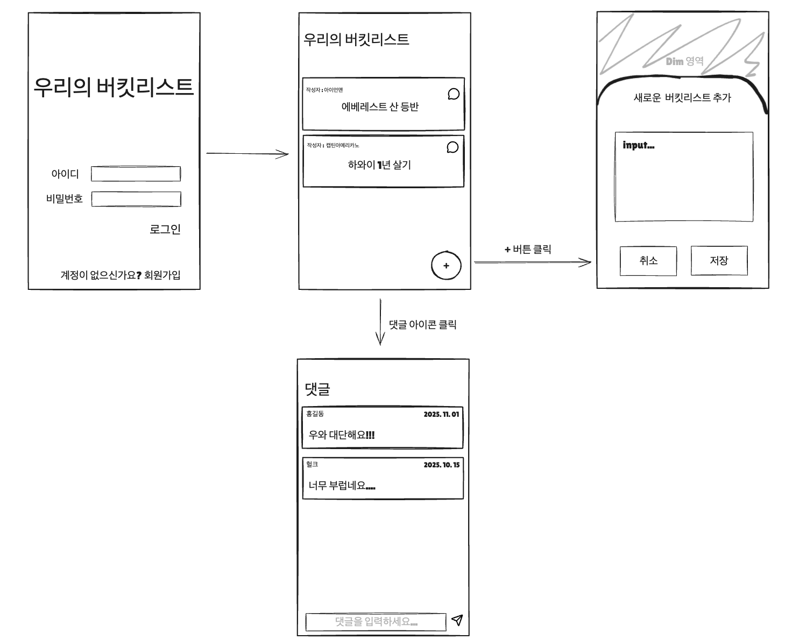
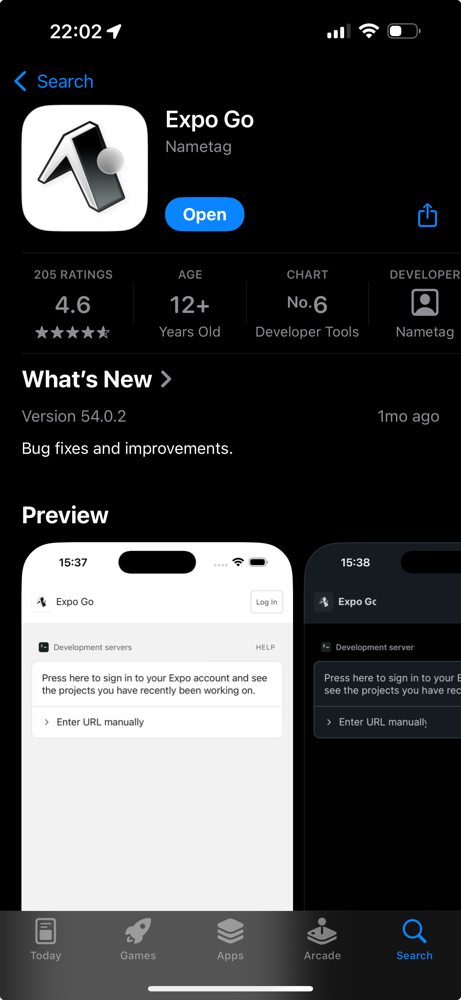
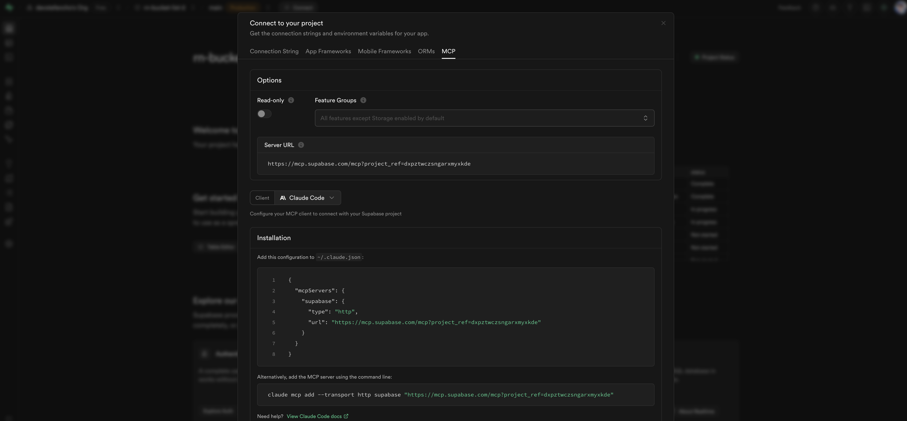
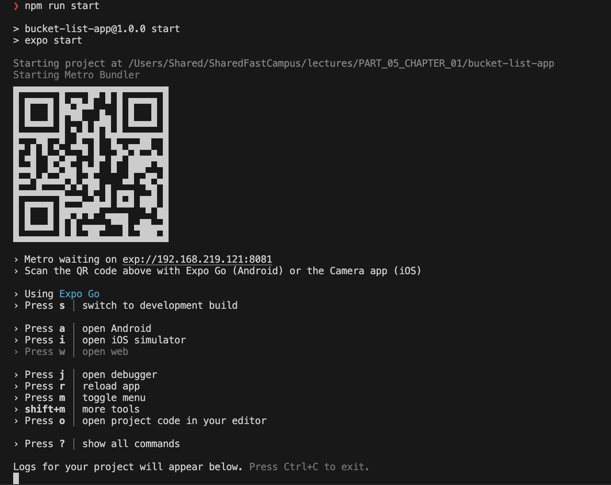

## 버킷리스트 앱

## 목적

React Native와 Expo를 사용해 모바일 버킷리스트 앱을 만들려고 한다.
사용자는 이메일/비밀번호 방식으로 로그인하고, 자신만의 버킷리스트를 생성하고 관리할 수 있다.
각 버킷리스트에는 댓글을 달 수 있으며, Supabase를 사용해 데이터베이스와 인증을 구성한다.





## 기술 스택

- React Native + Expo
- Supabase (인증 + 데이터베이스)
- TypeScript

## 사전 준비: Supabase MCP 설정

**Supabase MCP란?**
Claude Code에서 Supabase를 직접 제어할 수 있게 해주는 연결 도구입니다.

**설정 방법:**

1. Supabase 대시보드 접속 (https://supabase.com)
2. 새 프로젝트 생성 또는 기존 프로젝트 선택
3. 왼쪽 메뉴에서 **"Connect"** 클릭
4. **"MCP"** 탭 클릭
5. 표시된 JSON 설정을 복사
6. 로컬의 `.mcp.json` 파일을 열고 복사한 내용을 추가
7. Claude Code 재시작



**설정 완료 확인:**
```
> /mcp
```
명령어 실행 시 "Connected to supabase" 메시지가 보이면 성공!

**연결 후 데이터베이스 확인:**
```
> supabase에 연결된 database 확인해줘
```

Supabase MCP가 정상적으로 연결되면:
- 데이터베이스 스키마 목록 확인 가능 (auth, storage, public)
- 테이블 목록 및 구조 확인 가능
- 설치된 확장 기능 확인 가능
- 마이그레이션 이력 확인 가능

이제 Claude Code에서 직접 테이블을 생성하고 관리할 수 있습니다!

---

## 데이터베이스 구조 설계

버킷리스트 앱을 위해 다음과 같은 데이터베이스 구조가 필요하다:

### 1. 사용자 테이블
- Supabase Auth를 활용하여 자동으로 관리됨
- 이메일/비밀번호 방식의 인증 사용

### 2. 버킷리스트 테이블 (bucket_lists)
- id: 고유 식별자 (자동 생성)
- title: 버킷리스트 제목
- content: 버킷리스트 상세 내용
- completed: 완료 여부 (boolean)
- user_id: 작성자 ID (Supabase Auth user ID 참조)
- created_at: 생성 일시
- updated_at: 수정 일시

### 3. 댓글 테이블 (comments)
- id: 고유 식별자 (자동 생성)
- bucket_list_id: 버킷리스트 ID (bucket_lists 테이블 참조)
- user_id: 작성자 ID (Supabase Auth user ID 참조)
- comment: 댓글 내용
- created_at: 작성 일시

### 4. RLS (Row Level Security) 정책
- 사용자는 본인이 작성한 버킷리스트만 조회/생성/수정/삭제 가능
- 사용자는 본인이 작성한 댓글만 조회/생성/삭제 가능
- 인증되지 않은 사용자는 어떤 데이터도 접근 불가

---

## Prompt

### 1. Expo 프로젝트 생성 및 기본 설정

```
> React Native Expo로 버킷리스트 앱을 만들려고 해.
TypeScript를 사용하고, 기본 프로젝트 구조를 생성해줘.
프로젝트 이름은 bucket-list-app으로 해줘.
```

> 앱 생성이 완료되었으면, VS Code에서 terminal을 추가로 열고 `npm run start`로 서버를 실행하세요. 휴대폰 카메라로 QR 코드를 찍어서 expo 앱으로 들어가면 앱이 실행됩니다.


### 2. Supabase 클라이언트 설정

```
> @note.md 를 읽어보고, Supabase 클라이언트를 설정해줘.
환경변수 파일을 만들고 Supabase URL과 ANON KEY를 설정할 수 있도록 구성해줘.
lib/supabase.ts 파일을 만들어서 Supabase 클라이언트 인스턴스를 export해줘.
```

### 3. 데이터베이스 테이블 생성

```
> @note.md 의 데이터베이스 구조 설계를 참고해서 Supabase에 테이블을 생성해줘.
bucket_lists 테이블과 comments 테이블을 만들고,
RLS 정책도 설정해서 사용자가 본인의 데이터만 접근할 수 있도록 해줘.
```

### 4. 로그인/회원가입 화면 구현

```
> 로그인과 회원가입 화면을 구현해줘.
이메일과 비밀번호 입력 필드를 만들고,
Supabase Auth를 사용해서 회원가입과 로그인 기능을 구현해줘.
로그인 상태에 따라 화면을 전환할 수 있도록 네비게이션도 구성해줘.
```

### 5. 버킷리스트 목록 화면 구현

```
> 로그인한 사용자의 버킷리스트 목록을 보여주는 화면을 만들어줘.
Supabase에서 현재 사용자의 버킷리스트를 불러와서 리스트로 표시하고,
각 항목에는 제목과 완료 여부를 표시해줘.
하단에 플로팅 버튼(+ 버튼)을 추가해서 새 버킷리스트를 추가할 수 있도록 해줘.
```

### 6. 새 버킷리스트 추가 모달

```
> + 버튼을 누르면 Dim 배경과 함께 모달이 나타나도록 구현해줘.
모달에는 제목 입력 필드와 내용 입력 필드가 있어야 하고,
취소 버튼과 저장 버튼을 만들어줘.
저장 버튼을 누르면 Supabase에 새 버킷리스트가 추가되고 모달이 닫히도록 해줘.
```

### 7. 버킷리스트 CRUD 기능 구현

```
> 버킷리스트 항목을 눌렀을 때 상세 화면으로 이동하도록 만들어줘.
상세 화면에서는 제목과 내용을 수정할 수 있어야 하고,
완료 여부를 토글할 수 있는 체크박스와 삭제 버튼을 추가해줘.
수정 사항은 실시간으로 Supabase에 저장되도록 구현해줘.
```

### 8. 댓글 시스템 구현

```
> 버킷리스트 상세 화면 하단에 댓글 섹션을 추가해줘.
해당 버킷리스트에 달린 댓글 목록을 보여주고,
댓글 입력창과 전송 버튼을 만들어서 새 댓글을 추가할 수 있도록 해줘.
작성자 정보와 작성 날짜도 함께 표시해줘.
```

### 9. UI 마무리 및 네비게이션

```
> 전체적인 UI를 다듬어줘.
네비게이션 헤더를 추가하고 로그아웃 버튼을 만들어줘.
버킷리스트 항목이 완료되면 시각적으로 구분되도록 스타일을 적용하고,
전체적으로 사용자 친화적인 디자인으로 개선해줘.
```
