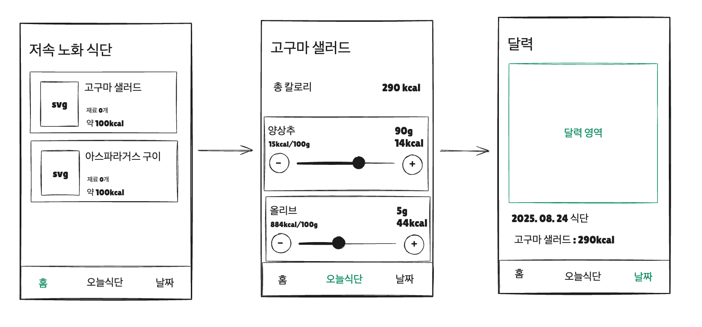

## 저속노화식단 앱

## 목적

React Native와 Expo를 사용해 모바일 저속노화식단 관리 앱을 만들려고 한다.
사용자는 로그인 없이 로컬에서 식단을 관리할 수 있으며, 각 식단의 영양소를 슬라이더로 조절하고 총 칼로리를 자동으로 계산한다.
달력 기능을 통해 날짜별 식단 기록을 확인할 수 있으며, 모든 데이터는 AsyncStorage를 사용해 기기에 저장된다.



## 기술 스택

- React Native + Expo
- TypeScript
- AsyncStorage (로컬 저장소)
- React Navigation (Tab Navigator)
- @react-native-community/slider
- react-native-calendars
- react-native-svg (SVG 아이콘 직접 그리기)

## 데이터 구조 설계

### 1. Meal (식단 메뉴)
- id: 고유 식별자 (UUID)
- name: 식단 이름 (예: "고구마 샐러드")
- icon: SVG 컴포넌트 이름
- ingredients: 영양소/재료 배열
- totalCalories: 총 칼로리 (자동 계산)

### 2. Ingredient (영양소/재료)
- name: 재료 이름 (예: "양상추", "올리브")
- amount: 현재 양 (g)
- caloriesPerUnit: 단위당 칼로리 (kcal/100g)
- currentCalories: 현재 칼로리 (자동 계산)

### 3. DailyLog (일일 식단 기록)
- date: 날짜 (YYYY-MM-DD)
- meals: 해당 날짜에 먹은 식단 배열
- totalCalories: 하루 총 칼로리

### 4. 샘플 식단 데이터
기본적으로 다음과 같은 저속노화 식단 메뉴를 제공:
- 고구마 샐러드 (약 100kcal)
- 아스파라거스 구이 (약 100kcal)
- 브로콜리 스프 (약 80kcal)
- 연어 구이 (약 250kcal)
- 블루베리 요거트 (약 120kcal)

---

## Prompt

### 1. Expo 프로젝트 생성 및 기본 설정

```
> React Native Expo로 저속노화식단 관리 앱을 만들려고 해.
TypeScript를 사용하고, 기본 프로젝트 구조를 생성해줘.
프로젝트 이름은 anti-aging-diet-app으로 해줘.
localhost port는 8082를 사용해줘.
```

> 앱 생성이 완료되었으면, VS Code에서 terminal을 추가로 열고 `npm run start`로 서버를 실행하세요. 휴대폰 카메라로 QR 코드를 찍어서 expo 앱으로 들어가면 앱이 실행됩니다.

### 2. 필요한 라이브러리 설치

```
> @note.md 를 읽어보고, 필요한 라이브러리들을 설치해줘.
React Navigation (Tab Navigator), AsyncStorage, react-native-svg,
@react-native-community/slider, react-native-calendars 등을 설치하고 설정해줘.
```

### 3. SVG 아이콘 컴포넌트 생성

```
> 각 식단 메뉴를 나타낼 SVG 아이콘을 직접 그려서 만들어줘.
고구마, 아스파라거스, 브로콜리, 연어, 블루베리 등의 간단한 SVG 아이콘을
components/icons/ 폴더에 React 컴포넌트로 만들어줘.
각 아이콘은 크기 조절이 가능하도록 props를 받도록 해줘.
```

### 4. AsyncStorage 유틸리티 구현

```
> AsyncStorage를 사용해서 식단 데이터를 저장하고 불러오는 유틸리티 함수를 만들어줘.
lib/storage.ts 파일을 만들어서 다음 기능을 구현해줘:
- 식단 메뉴 목록 저장/불러오기
- 일일 식단 기록 저장/불러오기
- 날짜별 식단 조회
TypeScript 타입도 함께 정의해줘.
```

### 5. 하단 탭 네비게이션 구성

```
> @wireframe.png 를 참고해서 하단 탭 네비게이션을 구성해줘.
3개의 탭을 만들어줘:
1. 홈 (저속노화 식단 메뉴 목록)
2. 오늘식단 (오늘 먹은 식단 기록)
3. 달력 (날짜별 식단 기록)
각 탭에 적절한 아이콘을 추가해줘.
```

### 6. 식단 메뉴 목록 화면 (홈)

```
> 홈 화면에 저속노화 식단 메뉴 카드를 리스트로 표시해줘.
@note.md 의 샘플 식단 데이터를 사용하고,
각 카드에는 SVG 아이콘, 식단 이름, 총 칼로리를 표시해줘.
카드를 누르면 해당 식단의 상세 화면으로 이동하도록 해줘.
```

### 7. 식단 상세 화면 - 영양소 슬라이더

```
> @wireframe.png 의 중간 화면을 참고해서 식단 상세 화면을 만들어줘.
상단에 식단 이름과 총 칼로리를 표시하고,
각 재료(영양소)마다 슬라이더를 추가해서 양을 조절할 수 있도록 해줘.
슬라이더 옆에는:
- 재료 이름
- 단위당 칼로리 (kcal/100g)
- 현재 양 (g)
- 현재 칼로리 (kcal)
를 표시하고, 슬라이더를 움직이면 실시간으로 총 칼로리가 업데이트되도록 해줘.
```

### 8. 오늘 먹은 식단 기록하기

```
> 식단 상세 화면 하단에 "오늘식단" 버튼을 추가해줘.
이 버튼을 누르면 현재 설정된 영양소 양과 함께 오늘 날짜로 식단이 기록되고,
AsyncStorage에 저장되도록 해줘.
저장이 완료되면 "오늘식단" 탭으로 자동 이동하도록 구현해줘.
```

### 9. 오늘식단 화면 구현

```
> "오늘식단" 탭 화면을 구현해줘.
오늘 날짜에 기록된 식단 목록을 보여주고,
각 식단의 이름과 칼로리를 표시해줘.
하단에는 오늘 먹은 총 칼로리를 표시하고,
각 항목을 스와이프하면 삭제할 수 있도록 해줘.
```

### 10. 달력 화면 구현

```
> @wireframe.png 의 오른쪽 화면을 참고해서 달력 화면을 만들어줘.
react-native-calendars 라이브러리를 사용해서 달력을 표시하고,
식단이 기록된 날짜에는 점이나 마커를 표시해줘.
날짜를 선택하면 해당 날짜의 식단 목록과 총 칼로리를 하단에 표시해줘.
```

### 11. 초기 데이터 세팅

```
> 앱을 처음 실행할 때 @note.md 의 샘플 식단 데이터가 자동으로 생성되도록 해줘.
AsyncStorage에 데이터가 없을 경우에만 초기 데이터를 세팅하고,
각 식단의 기본 영양소 정보도 함께 저장해줘.
```

### 12. UI 개선 및 마무리

```
> 전체적인 UI를 다듬어줘.
저속노화 식단 앱에 어울리는 초록색/헬스 테마의 색상을 적용하고,
카드와 버튼에 적절한 그림자 효과를 추가해줘.
슬라이더는 부드럽게 움직이도록 하고,
모든 화면에서 로딩 상태와 빈 상태를 처리해줘.
```
